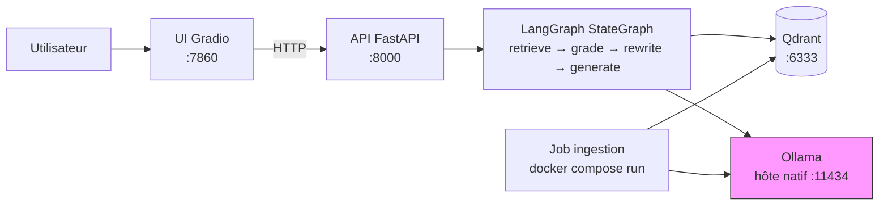

# rag-lab

Projet d'apprentissage : un RAG (Retrieval-Augmented Generation) construit avec LangChain et LangGraph, qui répond à des questions sur la documentation officielle de ces deux frameworks.

Le pipeline part d'un graphe simple (`retrieve → generate`) et évolue — sur le même `StateGraph` — vers une version agentique qui juge la pertinence des documents récupérés et reformule la question en cas d'échec (boucle bornée à 2 tentatives) avant de répondre.

## Stack

- **Orchestration** : LangGraph (`StateGraph`)
- **LLM / embeddings** : LangChain (`init_chat_model` / `init_embeddings`), switchable Ollama (local) ↔ API via variables d'environnement
- **Vector store** : Qdrant (Docker)
- **API** : FastAPI
- **UI** : Gradio

## Quickstart

Prérequis : Docker, [Ollama](https://ollama.com) installé et lancé (`ollama serve`) — Ollama reste natif, tout le reste tourne en conteneurs.

```bash
ollama pull llama3.2:3b
ollama pull nomic-embed-text

docker compose up -d qdrant api ui       # Qdrant, API (:8000), UI (:7860)
docker compose run --rm ingestion        # indexe la doc LangChain/LangGraph (~4000 chunks, quelques minutes) — à lancer une fois

# UI sur http://localhost:7860
```

### Développement local (sans Docker)

```bash
python3 -m venv .venv
.venv/bin/pip install -e ".[dev]"

cp .env.example .env   # ajuster si besoin (provider, modèles, ports)

docker compose up -d qdrant
.venv/bin/python -m ingestion.ingest

.venv/bin/uvicorn api.main:app --port 8000 &
.venv/bin/python -m ui.app
```

## Architecture



Tout tourne en conteneurs Docker (`docker compose up`) sauf Ollama, volontairement natif — le pattern courant même en production, où les serveurs LLM tournent à part des services applicatifs.

## Configuration

Variables d'environnement (voir `.env.example`) :

| Variable | Défaut | Description |
|---|---|---|
| `LLM_MODEL` | `ollama:llama3.2:3b` | Modèle de chat (`init_chat_model`) |
| `EMBEDDING_MODEL` | `ollama:nomic-embed-text` | Modèle d'embeddings (`init_embeddings`) |
| `QDRANT_URL` | `http://localhost:6333` | URL Qdrant |
| `QDRANT_COLLECTION` | `langchain_docs` | Collection Qdrant |
| `RAG_API_URL` | `http://localhost:8000` | URL de l'API, utilisée par l'UI |
| `OLLAMA_BASE_URL` | *(vide)* | URL d'Ollama pour les conteneurs `api`/`ingestion` (`http://host.docker.internal:11434` dans `docker-compose.yml`) ; ignorée si `LLM_MODEL`/`EMBEDDING_MODEL` ne pointe pas vers `ollama:` |

Pour utiliser une API au lieu d'Ollama : `LLM_MODEL=openai:gpt-4o-mini`, `EMBEDDING_MODEL=openai:text-embedding-3-small`, `OPENAI_API_KEY=...`.

Pour tracer chaque étape du graphe (utile pour comprendre `retrieve → grade → rewrite → generate`) : décommenter `LANGCHAIN_TRACING_V2`, `LANGCHAIN_API_KEY` et `LANGCHAIN_PROJECT` dans `.env` — LangChain envoie alors les traces à [smith.langchain.com](https://smith.langchain.com) sans aucun changement de code.

## Structure

```
ingestion/   # clone + chunk + embed + upsert la doc LangChain/LangGraph
graph/       # StateGraph : v1 (retrieve→generate) → v2 (+ grade/rewrite/loop)
config.py    # LLM / embeddings / vector store
api/         # FastAPI (POST /query, GET /health)
ui/          # UI de chat Gradio
tests/       # test du routing du graphe v2 (seule suite automatisée, décision volontaire)
```

Design complet : [docs/superpowers/specs/2026-08-11-rag-lab-design.md](docs/superpowers/specs/2026-08-11-rag-lab-design.md)
