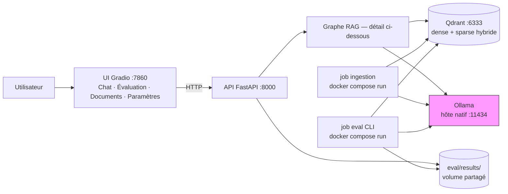
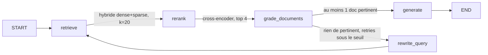

# rag-lab

Projet d'apprentissage : un RAG (Retrieval-Augmented Generation) construit avec LangChain et LangGraph, qui répond à des questions sur la documentation officielle de ces deux frameworks.

Le pipeline part d'un graphe simple (`retrieve → generate`) et évolue — sur le même `StateGraph` — vers une version agentique : recherche hybride (dense + sparse) avec reranking, jugement de pertinence par document, reformulation de la question en cas d'échec (boucle bornée à 2 tentatives). Un harnais d'évaluation LLM-judge et un petit dashboard d'exploitation (chat, évaluation, ajout de documents, paramètres) complètent le tout.

## Stack

- **Orchestration** : LangGraph (`StateGraph`)
- **LLM / embeddings** : LangChain (`init_chat_model` / `init_embeddings`), switchable Ollama (local) ↔ API via variables d'environnement
- **Vector store** : Qdrant (Docker), recherche hybride dense + sparse (BM25 via FastEmbed, fusion RRF native)
- **Reranking** : cross-encoder (FastEmbed)
- **Évaluation** : harnais LLM-judge maison (faithfulness / correctness) sur 18 questions de référence
- **API** : FastAPI
- **UI** : Gradio (4 onglets)

## Quickstart

Prérequis : Docker, [Ollama](https://ollama.com) installé et lancé (`ollama serve`) — Ollama reste natif, tout le reste tourne en conteneurs. Ollama doit écouter sur toutes les interfaces (`OLLAMA_HOST=0.0.0.0:11434 ollama serve`) pour être joignable depuis les conteneurs via `host.docker.internal`.

```bash
ollama pull llama3.2:3b
ollama pull nomic-embed-text

docker compose up -d qdrant api ui       # Qdrant, API (:8000), UI (:7860)
docker compose run --rm ingestion        # indexe la doc LangChain/LangGraph (~4000 chunks, quelques minutes) — à lancer une fois
docker compose run --rm eval             # évalue le pipeline sur 18 questions, écrit un rapport JSON dans eval/results/

# UI sur http://localhost:7860 — onglets Chat / Évaluation / Documents / Paramètres
```

Après une modification du code, reconstruire les images avant de relancer (`docker compose up` seul ne rebuild pas) :

```bash
docker compose up -d --build qdrant api ui
```

### Développement local (sans Docker)

```bash
python3 -m venv .venv
.venv/bin/pip install -e ".[dev]"

cp .env.example .env   # ajuster si besoin (provider, modèles, ports)

docker compose up -d qdrant
.venv/bin/python -m ingestion.ingest

.venv/bin/uvicorn api.main:app --port 8000 &
.venv/bin/python -m ui.app
```

## Architecture



Tout tourne en conteneurs Docker (`docker compose up`) sauf Ollama, volontairement natif — le pattern courant même en production, où les serveurs LLM tournent à part des services applicatifs. `eval/results/` est monté à la fois sur `api` et sur `eval` : un rapport écrit par `docker compose run --rm eval` ou par `POST /eval/run` est visible des deux côtés.

### Graphe LangGraph



`grade_documents` juge chaque document individuellement (pas le lot entier) : une réponse partiellement pertinente garde les documents utiles plutôt que de tout jeter.

## API

| Méthode | Route | Description |
|---|---|---|
| `GET` | `/health` | Vérifie que Qdrant est joignable |
| `GET` | `/config` | Configuration effective (lecture seule — aucune clé API n'est jamais exposée) |
| `POST` | `/query` | Pose une question au graphe RAG, retourne la réponse et les sources |
| `GET` | `/eval/runs` | Liste les rapports d'évaluation passés (résumé : moyennes faithfulness/correctness) |
| `GET` | `/eval/runs/{run_id}` | Détail d'un run (les 18 questions notées) |
| `POST` | `/eval/run` | Lance une nouvelle évaluation (synchrone, peut prendre plusieurs minutes en local) |
| `POST` | `/documents` | Upload un fichier `.md`/`.txt` (5 Mo max), l'ajoute à la collection existante — rien n'est effacé |

Implémentation : `api/main.py` (health/config/query) + `api/eval_routes.py` + `api/documents_routes.py`, tous deux montés depuis `api/main.py` ; `api/dependencies.py` porte le graphe partagé (`get_graph()`, en cache) pour éviter un import circulaire entre les deux routers et `main.py`.

## UI (Gradio, 4 onglets)

| Onglet | Usage |
|---|---|
| **Chat** | Pose des questions, affiche les sources citées |
| **Évaluation** | Liste les runs passés, affiche le détail d'un run sélectionné, bouton pour en lancer un nouveau |
| **Documents** | Upload d'un fichier `.md`/`.txt`, ajouté à la collection sans rien effacer |
| **Paramètres** | Configuration effective actuelle (lecture seule) |

Les onglets Évaluation et Paramètres se remplissent au chargement de la page dans le navigateur (`demo.load`), pas au démarrage du process Python — sinon l'UI planterait si l'API n'est pas encore prête au démarrage des conteneurs.

## Configuration

Variables d'environnement (voir `.env.example`) :

| Variable | Défaut | Description |
|---|---|---|
| `LLM_MODEL` | `ollama:llama3.2:3b` | Modèle de chat (`init_chat_model`) |
| `EMBEDDING_MODEL` | `ollama:nomic-embed-text` | Modèle d'embeddings denses (`init_embeddings`) |
| `SPARSE_EMBEDDING_MODEL` | `Qdrant/bm25` | Modèle d'embeddings sparse (FastEmbed, recherche hybride) |
| `RERANKER_MODEL` | `Xenova/ms-marco-MiniLM-L-6-v2` | Cross-encoder de reranking (FastEmbed) |
| `EVAL_JUDGE_MODEL` | *(vide → réutilise `LLM_MODEL`)* | Modèle juge pour l'évaluation (peut être plus costaud que le modèle évalué) |
| `QDRANT_URL` | `http://localhost:6333` | URL Qdrant |
| `QDRANT_COLLECTION` | `langchain_docs` | Collection Qdrant |
| `RAG_API_URL` | `http://localhost:8000` | URL de l'API, utilisée par l'UI |
| `OLLAMA_BASE_URL` | *(vide)* | URL d'Ollama pour les conteneurs `api`/`ingestion`/`eval` (`http://host.docker.internal:11434` dans `docker-compose.yml`) ; ignorée si le modèle correspondant ne pointe pas vers `ollama:` |

Pour utiliser une API au lieu d'Ollama : `LLM_MODEL=openai:gpt-4o-mini`, `EMBEDDING_MODEL=openai:text-embedding-3-small`, `OPENAI_API_KEY=...`.

Pour tracer chaque étape du graphe (utile pour comprendre `retrieve → rerank → grade → rewrite → generate`) : décommenter `LANGCHAIN_TRACING_V2`, `LANGCHAIN_API_KEY` et `LANGCHAIN_PROJECT` dans `.env` — LangChain envoie alors les traces à [smith.langchain.com](https://smith.langchain.com) sans aucun changement de code.

## Structure

```
ingestion/   # clone + chunk + embed (dense+sparse) + upsert la doc LangChain/LangGraph
             # chunk_document() est réutilisé par l'upload de documents (api/documents_routes.py)
graph/       # StateGraph : retrieve → rerank (cross-encoder) → grade_documents → generate, avec boucle rewrite_query
config.py    # LLM / embeddings dense+sparse / vector store hybride / reranker / juge d'évaluation
api/         # FastAPI : main.py (health/config/query) + eval_routes.py + documents_routes.py + dependencies.py
ui/          # UI Gradio à 4 onglets : chat_tab / eval_tab / documents_tab / config_tab, assemblés dans app.py
eval/        # golden_dataset.json (18 Q/A), judge.py (LLM-judge faithfulness/correctness), run_eval.py (CLI, logique partagée avec l'API)
tests/       # tests unitaires : routing du graphe, judge, ingestion, run_eval, endpoints API, formatage des onglets UI
```

## Historique de conception

Chaque évolution majeure a sa spec (le "pourquoi") et son plan d'implémentation (le "comment") dans `docs/superpowers/` :

| Étape | Spec | Plan |
|---|---|---|
| Pipeline initial + containerisation | [rag-lab-design.md](docs/superpowers/specs/2026-08-11-rag-lab-design.md) | [rag-lab-implementation.md](docs/superpowers/plans/2026-08-11-rag-lab-implementation.md), [containerization-implementation.md](docs/superpowers/plans/2026-08-11-containerization-implementation.md) |
| Recherche RAG avancée — roadmap | [advanced-rag-improvements-design.md](docs/superpowers/specs/2026-08-11-advanced-rag-improvements-design.md) | — |
| Tier 0 — ingestion idempotente, grading par document, tracing | — | [tier0-rag-fixes.md](docs/superpowers/plans/2026-08-11-tier0-rag-fixes.md) |
| Tier 1 — hybrid search + reranking | [tier1-hybrid-search-reranking-design.md](docs/superpowers/specs/2026-08-11-tier1-hybrid-search-reranking-design.md) | [tier1-hybrid-search-reranking.md](docs/superpowers/plans/2026-08-11-tier1-hybrid-search-reranking.md) |
| Tier 2 — harnais d'évaluation | [tier2-eval-harness-design.md](docs/superpowers/specs/2026-08-11-tier2-eval-harness-design.md) | [tier2-eval-harness.md](docs/superpowers/plans/2026-08-11-tier2-eval-harness.md) |
| Dashboard — API | [dashboard-api-design.md](docs/superpowers/specs/2026-08-12-dashboard-api-design.md) | [dashboard-api.md](docs/superpowers/plans/2026-08-12-dashboard-api.md) |
| Dashboard — UI | [dashboard-ui-design.md](docs/superpowers/specs/2026-08-12-dashboard-ui-design.md) | [dashboard-ui.md](docs/superpowers/plans/2026-08-12-dashboard-ui.md) |
