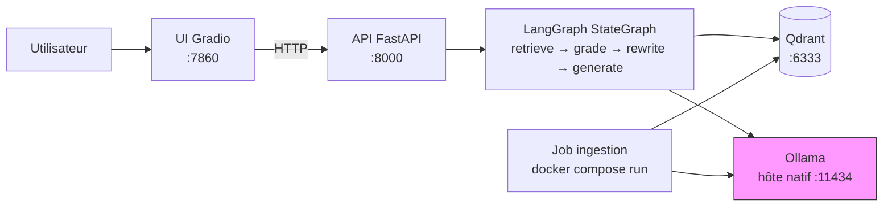

# Containerization Implementation Plan

> **For agentic workers:** REQUIRED SUB-SKILL: Use superpowers:subagent-driven-development (recommended) or superpowers:executing-plans to implement this plan task-by-task. Steps use checkbox (`- [ ]`) syntax for tracking.

**Goal:** Containerize rag-lab's API, UI, and ingestion job into one Docker image orchestrated by an extended `docker-compose.yml`, add a GitHub Actions CI running the test suite, and document it all in the README with an architecture diagram — so `docker compose up` runs the whole system except Ollama.

**Architecture:** A single `Dockerfile` (built from `pyproject.toml`, which already installs the whole package) backs three `docker-compose.yml` services — `api`, `ui`, `ingestion` (the last gated behind a `tools` profile, since it's a one-off job, not a long-running service) — alongside the existing `qdrant` service. Ollama stays native; containers reach it via `host.docker.internal`.

**Tech Stack:** Docker, Docker Compose, `python:3.13-slim`, GitHub Actions.

## Global Constraints

- Ollama stays native, never containerized — a deliberate choice, not a gap to fill later.
- One Docker image shared by `api`, `ui`, and `ingestion` — no per-service Dockerfile, no multi-stage build.
- `ingestion` carries `profiles: ["tools"]` — never started by a plain `docker compose up`.
- `ui` reaches `api` by Docker service name (`http://api:8000`), never `localhost`.
- `api`/`ingestion` reach Ollama via `http://host.docker.internal:11434`, wired through `extra_hosts: ["host.docker.internal:host-gateway"]`.
- The `qdrant` healthcheck uses `bash`'s `/dev/tcp` — `qdrant/qdrant:latest` has no `curl`/`wget`/`nc` (verified directly against the image).
- The image must install `git` — `ingestion/ingest.py` shells out to `git clone`, and `python:3.13-slim` doesn't include it.
- No new automated tests for containerization itself — verified manually (`docker compose up` + real requests), consistent with the project's existing YAGNI stance on test coverage.
- CI runs `pytest` only — no Docker image build/push in CI.
- Git commits: English, imperative mood, Conventional Commits prefix (`feat|fix|docs|chore|refactor|test|ci|style`), subject ≤72 chars, no trailing period.

---

## Task 1: `config.py` — optional `OLLAMA_BASE_URL` passthrough

**Files:**
- Modify: `config.py:1-15` (imports and module constants), `config.py:33-43` (`get_llm`, `get_embeddings`)

**Interfaces:**
- Consumes: nothing new.
- Produces: `OLLAMA_BASE_URL: str` module constant (empty string if unset) and `_ollama_kwargs(model: str) -> dict` helper. `get_llm()` and `get_embeddings()` keep their exact existing signatures (no args, same return types) — Tasks 2-5 don't need to know anything changed here beyond the env var name.

- [ ] **Step 1: Add the constant and helper**

Current `config.py` (for reference, do not change lines 1-14 except adding the new constant):

```python
import os
from functools import lru_cache

from dotenv import load_dotenv
from langchain.chat_models import init_chat_model
from langchain.embeddings import init_embeddings
from langchain_core.embeddings import Embeddings
from langchain_qdrant import QdrantVectorStore
from qdrant_client import QdrantClient

load_dotenv()

QDRANT_URL = os.environ.get("QDRANT_URL", "http://localhost:6333")
QDRANT_COLLECTION = os.environ.get("QDRANT_COLLECTION", "langchain_docs")
```

Add one line after `QDRANT_COLLECTION` and a new helper function right after the `_NomicPrefixedEmbeddings` class (before `get_llm`):

```python
QDRANT_COLLECTION = os.environ.get("QDRANT_COLLECTION", "langchain_docs")
OLLAMA_BASE_URL = os.environ.get("OLLAMA_BASE_URL", "")
```

```python
def _ollama_kwargs(model: str) -> dict:
    if OLLAMA_BASE_URL and model.startswith("ollama:"):
        return {"base_url": OLLAMA_BASE_URL}
    return {}
```

- [ ] **Step 2: Wire it into `get_llm` and `get_embeddings`**

Change:
```python
def get_llm():
    model = os.environ.get("LLM_MODEL", "ollama:llama3.2:3b")
    return init_chat_model(model)


def get_embeddings():
    model = os.environ.get("EMBEDDING_MODEL", "ollama:nomic-embed-text")
    embeddings = init_embeddings(model)
    if "nomic-embed-text" in model:
        return _NomicPrefixedEmbeddings(embeddings)
    return embeddings
```
to:
```python
def get_llm():
    model = os.environ.get("LLM_MODEL", "ollama:llama3.2:3b")
    return init_chat_model(model, **_ollama_kwargs(model))


def get_embeddings():
    model = os.environ.get("EMBEDDING_MODEL", "ollama:nomic-embed-text")
    embeddings = init_embeddings(model, **_ollama_kwargs(model))
    if "nomic-embed-text" in model:
        return _NomicPrefixedEmbeddings(embeddings)
    return embeddings
```

- [ ] **Step 3: Verify the native (default) path still works unchanged**

Run:
```bash
.venv/bin/python -c "
from config import get_llm
print(get_llm().invoke('Say OK.').content)
"
```
Expected: a short reply from Ollama (proves nothing broke when `OLLAMA_BASE_URL` is unset).

- [ ] **Step 4: Verify `OLLAMA_BASE_URL` actually gets applied**

Run:
```bash
OLLAMA_BASE_URL=http://localhost:11434 .venv/bin/python -c "
from config import get_llm
llm = get_llm()
print(llm.base_url)
"
```
Expected: prints `http://localhost:11434` (proves the kwarg is really reaching the underlying `ChatOllama`, not silently dropped).

- [ ] **Step 5: Commit**

```bash
git add config.py
git commit -m "feat: support OLLAMA_BASE_URL for containerized Ollama access"
```

---

## Task 2: `Dockerfile` and `.dockerignore`

**Files:**
- Create: `Dockerfile`
- Create: `.dockerignore`

**Interfaces:**
- Consumes: `pyproject.toml` (unchanged), the existing `api/`, `ui/`, `graph/`, `ingestion/`, `config.py`.
- Produces: a buildable image tagged however the builder names it, containing `git` and the project installed via `pip install -e .`. Task 3's `docker-compose.yml` builds from this file (`build: .`) — no other interface beyond "the image builds and the package imports."

- [ ] **Step 1: Write `.dockerignore`**

```
.venv/
.git/
__pycache__/
*.pyc
*.egg-info/
.pytest_cache/
.env
docs/
```

- [ ] **Step 2: Write `Dockerfile`**

```dockerfile
FROM python:3.13-slim

RUN apt-get update \
    && apt-get install -y --no-install-recommends git \
    && rm -rf /var/lib/apt/lists/*

WORKDIR /app

COPY . .

RUN pip install --no-cache-dir -e .
```

- [ ] **Step 3: Build the image and verify it**

Run:
```bash
docker build -t rag-lab:test .
```
Expected: build completes with no errors.

Run:
```bash
docker run --rm rag-lab:test python -c "import api.main, ui.app, ingestion.ingest, graph.build; print('imports OK')"
```
Expected: `imports OK`.

Run:
```bash
docker run --rm rag-lab:test git --version
```
Expected: prints a `git version ...` string (proves `git` installed correctly for `ingestion/ingest.py`'s `subprocess.run(["git", "clone", ...])`).

- [ ] **Step 4: Commit**

```bash
git add Dockerfile .dockerignore
git commit -m "feat: add Dockerfile for api/ui/ingestion image"
```

---

## Task 3: Extend `docker-compose.yml` with `api`, `ui`, `ingestion`

**Files:**
- Modify: `docker-compose.yml` (currently only the `qdrant` service, shown in full below)

**Interfaces:**
- Consumes: the `Dockerfile` from Task 2 (`build: .`), the `OLLAMA_BASE_URL` env var from Task 1, the existing `api/main.py` (`uvicorn api.main:app`), `ui/app.py` (`python -m ui.app`), `ingestion/ingest.py` (`python -m ingestion.ingest`) — all unchanged, just invoked differently.
- Produces: running `api` (port 8000), `ui` (port 7860), `qdrant` (port 6333) via `docker compose up -d`; `ingestion` runnable on demand via `docker compose run --rm ingestion`. Task 5 (README) documents these exact commands.

- [ ] **Step 1: Replace `docker-compose.yml` in full**

Current content (for reference):
```yaml
services:
  qdrant:
    image: qdrant/qdrant:latest
    ports:
      - "6333:6333"
    volumes:
      - qdrant_data:/qdrant/storage

volumes:
  qdrant_data:
```

New content:
```yaml
services:
  qdrant:
    image: qdrant/qdrant:latest
    ports:
      - "6333:6333"
    volumes:
      - qdrant_data:/qdrant/storage
    healthcheck:
      test: ["CMD-SHELL", "bash -c 'echo > /dev/tcp/localhost/6333'"]
      interval: 5s
      timeout: 3s
      retries: 10

  api:
    build: .
    command: uvicorn api.main:app --host 0.0.0.0 --port 8000
    ports:
      - "8000:8000"
    environment:
      QDRANT_URL: http://qdrant:6333
      OLLAMA_BASE_URL: http://host.docker.internal:11434
    extra_hosts:
      - "host.docker.internal:host-gateway"
    depends_on:
      qdrant:
        condition: service_healthy

  ui:
    build: .
    command: python -m ui.app
    ports:
      - "7860:7860"
    environment:
      RAG_API_URL: http://api:8000
    depends_on:
      - api

  ingestion:
    build: .
    command: python -m ingestion.ingest
    profiles: ["tools"]
    environment:
      QDRANT_URL: http://qdrant:6333
      OLLAMA_BASE_URL: http://host.docker.internal:11434
    extra_hosts:
      - "host.docker.internal:host-gateway"
    depends_on:
      qdrant:
        condition: service_healthy

volumes:
  qdrant_data:
```

- [ ] **Step 2: Verify `api`/`ui`/`qdrant` come up and talk to each other**

Prerequisite: `ollama serve` running natively with `llama3.2:3b` and `nomic-embed-text` pulled (already the case from earlier work on this project).

Run:
```bash
docker compose up -d qdrant api ui
sleep 5
curl -s http://localhost:8000/health
```
Expected: `{"status":"ok"}`.

Run:
```bash
curl -s -X POST http://localhost:8000/query -H "Content-Type: application/json" -d '{"question": "How do nodes and edges work in LangGraph?"}'
```
Expected: JSON with a non-empty `answer` and `sources` starting with `https://docs.langchain.com/`. This proves `api` (in its container) reached Ollama via `host.docker.internal` and Qdrant via the `qdrant` service name.

Run:
```bash
curl -s -o /dev/null -w "%{http_code}\n" http://localhost:7860/
```
Expected: `200` (the `ui` container started and is serving).

- [ ] **Step 3: Verify `ingestion`'s profile gating and the job itself**

Run:
```bash
docker compose ps --services
```
Expected: `qdrant`, `api`, `ui` listed — `ingestion` NOT listed (proves `profiles: ["tools"]` keeps it out of a plain `up`).

Run:
```bash
docker compose run --rm ingestion
```
Expected: `Ingested <N> chunks into 'langchain_docs'.` (proves the container can reach GitHub to clone, Ollama via `host.docker.internal` to embed, and Qdrant via service name to upsert — the full path this service exists for).

- [ ] **Step 4: Tear down**

```bash
docker compose down
```

- [ ] **Step 5: Commit**

```bash
git add docker-compose.yml
git commit -m "feat: add api, ui, and ingestion services to docker-compose"
```

---

## Task 4: GitHub Actions CI

**Files:**
- Create: `.github/workflows/ci.yml`

**Interfaces:**
- Consumes: `pyproject.toml`'s `dev` extra, `tests/test_graph_routing.py` (both unchanged).
- Produces: a CI check on every push/PR. Nothing downstream depends on this task's internals.

- [ ] **Step 1: Write `.github/workflows/ci.yml`**

```yaml
name: CI

on:
  push:
  pull_request:

jobs:
  test:
    runs-on: ubuntu-latest
    steps:
      - uses: actions/checkout@v4
      - uses: actions/setup-python@v5
        with:
          python-version: "3.13"
      - run: pip install -e ".[dev]"
      - run: pytest tests/ -v
```

- [ ] **Step 2: Verify the workflow file is valid YAML**

Run:
```bash
.venv/bin/python -c "import yaml; yaml.safe_load(open('.github/workflows/ci.yml')); print('valid YAML')"
```
Expected: `valid YAML`. (`pyyaml` ships as a transitive dependency of this project's stack; if the import fails, run `.venv/bin/pip install pyyaml` first — it's only needed for this one-off check, not added to `pyproject.toml`.)

- [ ] **Step 3: Verify the exact commands the workflow runs actually pass locally**

Run:
```bash
.venv/bin/pip install -e ".[dev]"
.venv/bin/pytest tests/ -v
```
Expected: 5 passed (this is the same environment GitHub's `ubuntu-latest` + Python 3.13 runner will reproduce — the test suite is pure Python with no OS-specific behavior and no live network/Ollama/Qdrant calls).

- [ ] **Step 4: Commit**

```bash
git add .github/workflows/ci.yml
git commit -m "ci: run pytest on push and pull request"
```

---

## Task 5: README — Docker quickstart and architecture diagram

**Files:**
- Modify: `README.md` (full current content shown below)

**Interfaces:**
- Consumes: the exact commands proven in Tasks 2-4.
- Produces: updated documentation. Terminal task — nothing depends on this.

- [ ] **Step 1: Replace the "Quickstart" section**

Current:
```markdown
## Quickstart

Prérequis : Docker, [Ollama](https://ollama.com) installé et lancé (`ollama serve`).

```bash
python3 -m venv .venv
.venv/bin/pip install -e ".[dev]"

cp .env.example .env   # ajuster si besoin (provider, modèles, ports)

ollama pull llama3.2:3b
ollama pull nomic-embed-text

docker compose up -d                    # Qdrant sur localhost:6333
.venv/bin/python -m ingestion.ingest     # indexe la doc LangChain/LangGraph (~4000 chunks, quelques minutes)

.venv/bin/uvicorn api.main:app --port 8000 &
.venv/bin/python -m ui.app                # UI de chat sur http://127.0.0.1:7860
```
```

New:
```markdown
## Quickstart

Prérequis : Docker, [Ollama](https://ollama.com) installé et lancé (`ollama serve`) — Ollama reste natif, tout le reste tourne en conteneurs.

```bash
ollama pull llama3.2:3b
ollama pull nomic-embed-text

docker compose up -d qdrant api ui       # Qdrant, API (:8000), UI (:7860)
docker compose run --rm ingestion        # indexe la doc LangChain/LangGraph (~4000 chunks, quelques minutes) — à lancer une fois

# UI sur http://localhost:7860
```

### Développement local (sans Docker)

```bash
python3 -m venv .venv
.venv/bin/pip install -e ".[dev]"

cp .env.example .env   # ajuster si besoin (provider, modèles, ports)

docker compose up -d qdrant
.venv/bin/python -m ingestion.ingest

.venv/bin/uvicorn api.main:app --port 8000 &
.venv/bin/python -m ui.app
```
```

- [ ] **Step 2: Add an "Architecture" section with the Mermaid diagram, after "Quickstart" and before "Configuration"**

```markdown
## Architecture



Tout tourne en conteneurs Docker (`docker compose up`) sauf Ollama, volontairement natif — le pattern courant même en production, où les serveurs LLM tournent à part des services applicatifs.
```

- [ ] **Step 3: Add a row for `OLLAMA_BASE_URL` to the Configuration table**

Current table:
```markdown
| Variable | Défaut | Description |
|---|---|---|
| `LLM_MODEL` | `ollama:llama3.2:3b` | Modèle de chat (`init_chat_model`) |
| `EMBEDDING_MODEL` | `ollama:nomic-embed-text` | Modèle d'embeddings (`init_embeddings`) |
| `QDRANT_URL` | `http://localhost:6333` | URL Qdrant |
| `QDRANT_COLLECTION` | `langchain_docs` | Collection Qdrant |
| `RAG_API_URL` | `http://localhost:8000` | URL de l'API, utilisée par l'UI |
```

New table:
```markdown
| Variable | Défaut | Description |
|---|---|---|
| `LLM_MODEL` | `ollama:llama3.2:3b` | Modèle de chat (`init_chat_model`) |
| `EMBEDDING_MODEL` | `ollama:nomic-embed-text` | Modèle d'embeddings (`init_embeddings`) |
| `QDRANT_URL` | `http://localhost:6333` | URL Qdrant |
| `QDRANT_COLLECTION` | `langchain_docs` | Collection Qdrant |
| `RAG_API_URL` | `http://localhost:8000` | URL de l'API, utilisée par l'UI |
| `OLLAMA_BASE_URL` | *(vide)* | URL d'Ollama pour les conteneurs `api`/`ingestion` (`http://host.docker.internal:11434` dans `docker-compose.yml`) ; ignorée si `LLM_MODEL`/`EMBEDDING_MODEL` ne pointe pas vers `ollama:` |
```

- [ ] **Step 4: Verify the diagram renders**

Open `README.md` on GitHub after pushing (or in any Mermaid-aware Markdown previewer) and confirm the diagram renders without syntax errors — Mermaid syntax errors show as a visible error block instead of a diagram, so this is a quick visual check, not a command.

- [ ] **Step 5: Commit**

```bash
git add README.md
git commit -m "docs: document Docker quickstart and add architecture diagram"
```
