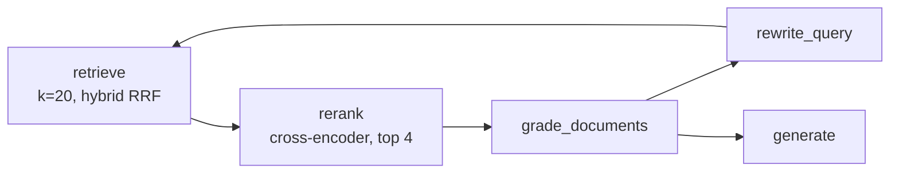

# Tier 1 — Hybrid Search + Reranking Design

Date: 2026-08-11
Status: approved, ready for implementation planning

## Why this document

Tier 0 (idempotent ingestion, per-document grading, LangSmith tracing) is merged into `main`. This document scopes the next increment from the roadmap in [2026-08-11-advanced-rag-improvements-design.md](2026-08-11-advanced-rag-improvements-design.md): items 4 and 5 of Tier 1 — hybrid search (dense + sparse) and cross-encoder reranking. Item 6 (contextual retrieval) is explicitly deferred to its own future pass: it requires ~4000 additional LLM calls at ingestion time, which is a materially different cost/time profile from the two retrieval-only changes here and doesn't need to land in the same re-ingestion.

## Current pipeline (post Tier 0)

`retrieve → grade_documents → rewrite_query → generate`, where `retrieve` does dense-only `similarity_search(query, k=4)` against Qdrant (`graph/build.py:7-12`), and `grade_documents` grades each of those documents individually (Tier 0 fix). Ingestion (`ingestion/ingest.py`) embeds chunks with a single dense embedding model and calls `QdrantVectorStore.from_texts(..., force_recreate=True)`.

## Approach

Add a `fastembed` dependency (ONNX runtime, CPU-only, no `torch`) to cover both new capabilities with one library, instead of two:

- **Sparse embeddings** via `langchain_qdrant.FastEmbedSparse(model_name="Qdrant/bm25")` — the default model name of that class, verified via `inspect.signature`. BM25 (not a neural sparse model like SPLADE) is the right default here: it's deterministic, needs no model download beyond a small vocabulary/IDF artifact, and specifically helps this corpus because it's full of exact API identifiers (`RunnableParallel`, `StateGraph`, etc.) that dense embeddings tend to blur together.
- **Reranking** via `fastembed.rerank.cross_encoder.TextCrossEncoder(model_name="Xenova/ms-marco-MiniLM-L-6-v2")` — verified installed and inspected: this model is 0.08 GB, the smallest in fastembed's supported list, appropriate for a CPU-only lab setup already running a 3B local LLM. `TextCrossEncoder.rerank(query, documents, batch_size=64) -> Iterable[float]` returns relevance **scores** in the same order as the input documents — it does not sort or truncate; the caller (our new graph node) is responsible for pairing scores back to `Document` objects and sorting.

Rejected alternatives: `sentence-transformers`/`torch` for reranking (heavier, no added quality benefit at this scale) and a hand-rolled BM25 + LLM-as-reranker (reimplements RRF fusion by hand and duplicates what `grade_documents` already does — worse for more code).

## Architecture

- **Ingestion** (`ingestion/ingest.py`): construct a `FastEmbedSparse` alongside the existing dense `embeddings`, and pass both `retrieval_mode=RetrievalMode.HYBRID` and `sparse_embedding=...` to `QdrantVectorStore.from_texts(...)`. The existing `force_recreate=True` (Tier 0) is what makes this safe — the collection's vector schema changes (dense + sparse instead of dense-only), so it must be rebuilt, not appended to. `from_texts`'s signature already accepts both `sparse_embedding` and `retrieval_mode` params (verified via `inspect.signature`), so no new indexing logic beyond passing them.
- **Config** (`config.py`): new `get_sparse_embeddings() -> FastEmbedSparse`, mirroring the existing `get_embeddings()`. `get_vectorstore()` passes `retrieval_mode=RetrievalMode.HYBRID` and `sparse_embedding=get_sparse_embeddings()` — both params confirmed present on `QdrantVectorStore.__init__` too, not just `from_texts`. New `get_reranker() -> TextCrossEncoder`, constructed once (module-level `lru_cache`, matching the existing `get_vectorstore()` pattern) since loading the ONNX model has a fixed cost that shouldn't repeat per request.
- **Graph** (`graph/build.py`): `make_retrieve` gains an optional `k` parameter (default 4, unchanged for `build_graph_v1`, the deliberately-naive baseline graph). `build_graph_v2` calls it with `k=20` — `similarity_search`'s `hybrid_fusion` parameter defaults to `None`, which the installed `langchain_qdrant` resolves to RRF fusion automatically in `HYBRID` mode (verified via signature; the fusion itself is computed server-side by Qdrant, not client code). A new `make_rerank(reranker)` node sits between `retrieve` and `grade_documents` in `build_graph_v2` only: it calls `reranker.rerank(question, [doc.page_content for doc in documents])`, zips scores back onto the `Document` list, sorts descending, and keeps the top 4 — restoring the same document count that `grade_documents` and `generate` were already built around, so neither needs to change. `build_graph_v1` is untouched: it's the intentionally-simple baseline this project keeps for comparison (per the README), and giving it a 20-document context without reranking would silently change its behavior rather than leave it as the naive reference point.
- **State** (`graph/state.py`): unchanged — `rerank` consumes and produces the same `{"documents": list[Document]}` shape as every other node.
- **API** (`api/main.py`): `get_graph()` passes a third argument, `get_reranker()`, to `build_graph_v2`.

## Dependency

Add `fastembed>=0.8.0` to `pyproject.toml` (0.8.0 is the version installed and inspected during this design). Confirmed via installation in a scratch venv: no `torch` pulled in, ONNX runtime only. The BM25 sparse model needs no download (it's algorithmic, not a neural weights file); the `Xenova/ms-marco-MiniLM-L-6-v2` reranker model downloads once (~80MB) on first use and is cached under fastembed's local cache directory.

## Testing

Follow the existing `FakeLLM`/`FakeVectorStore` pattern in `tests/test_graph_routing.py`: a `FakeReranker` whose `.rerank(query, documents)` returns a pre-programmed list of scores, used to verify `rerank` sorts and truncates correctly (e.g., 5 documents in, scores control which 4 survive and in what order), plus an empty-input edge case. No live Qdrant/fastembed model needed for this unit test, consistent with how the rest of the graph's node-level tests work.

The ingestion-side change (hybrid indexing) has no automated test today (same reasoning as Tier 0's Task 1: needs a live Qdrant + embeddings backend) — manual verification via re-ingestion and a hybrid query, same shape as Tier 0's Task 1 verification.

## Explicitly out of scope for this pass

- **Contextual retrieval** (roadmap item 6) — deferred to a future pass per the cost/time tradeoff discussed above.
- **Evaluation harness** (roadmap Tier 2) — not yet built; this pass is judged qualitatively (does hybrid retrieval surface the right chunks for identifier-heavy questions that dense-only missed) until Tier 2 exists.
